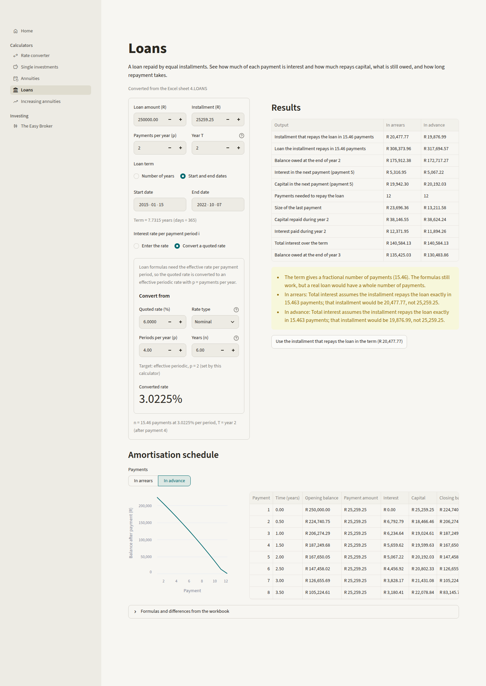

# Interest Rate Calculator (Excel → Python)

A Python and Streamlit rebuild of the BWIA 121 Interest Rate Calculator workbook by Simon Motlhodimang (North-West University). The app has the workbook's six tools:

| Page | What it does |
|---|---|
| Rate converter | Convert between effective annual, effective periodic, nominal, simple and continuous rates |
| Single investments | Solve for future value, present value, term, rate or interest earned on one amount |
| Annuities | Level payments in arrears or in advance: values, installments, term and rate |
| Loans | Installments, balances, interest/capital split, year totals and an amortisation schedule |
| Increasing annuities | Geometric and stepped increasing annuities, plus the retirement plan |
| The Easy Broker | Share purchase costs in USD and ZAR, and projected values from simulated returns |

The original workbook is kept in `reference/` and serves as the test oracle. On 1,056 compared outputs, Python matches Excel to floating-point precision everywhere the workbook's formula is correct (largest difference 8.6 × 10⁻¹³). The remaining 227 outputs are 16 documented Excel formula defects, each proven by recreating Excel's wrong formula and cross-checking Python's answer independently. See [`docs/validation_report.md`](docs/validation_report.md).



---

## Quick start

Requires Python 3.10 or newer.

```bat
cd "C:\Users\kgatl\Documents\Portfolio Website\Project 1 -- Interest Rate Calculator"
python -m venv .venv
.venv\Scripts\activate
pip install -r requirements.txt
streamlit run app.py
```

The app opens at <http://localhost:8501>. On Windows you can also double-click `run_app.bat`, which does the same steps.

Run the tests:

```bat
pip install -r requirements-dev.txt
python -m pytest
```

---

## Project structure

```
.
├── app.py                        Streamlit entry point: page config + navigation
├── calculator/                   The financial engine. Pure Python, no Streamlit
│   ├── common.py                 RateType / Timing enums, CalculationError, input checks
│   ├── dates.py                  years_between(): Actual/365 term from two dates
│   ├── rates.py                  Rate conversions via the effective annual rate
│   ├── single_investment.py      FV, PV, term, rate, interest earned; Outcome enum
│   ├── annuities.py              Level annuities in arrears/advance; rate solver
│   ├── loans.py                  Installment, balance, payment split, schedule
│   ├── increasing_annuities.py   Geometric + stepped increasing annuities, retirement plan
│   ├── broker.py                 The Easy Broker: market data, costs, simulated returns, FX
│   └── data/
│       ├── companies.csv         50 companies: country, exchange, price (from the workbook)
│       └── country_returns.csv   Return band per country (from the workbook)
├── ui/                           Streamlit interface. No financial logic here
│   ├── components.py             Shared widgets: term input, rate input + converter, tables
│   ├── formatting.py             R / $ / % display formats
│   └── pages/                    One file per page (home, rate_converter, …, easy_broker)
├── validation/                   Excel-vs-Python comparison machinery
│   ├── excel_spec.py             Which cell holds which input/output; test scenarios
│   ├── known_discrepancies.py    Registry of Excel defects D1–D18: where, Excel's formula, checks
│   ├── excel_parity.py           Runs every scenario through Python and compares
│   └── fixtures/                 Reference values from Excel (saved) and LibreOffice (recalculated)
├── tests/                        pytest suite (unit tests + Excel parity)
├── tools/                        One-off scripts that rebuild data files and fixtures
│   ├── export_market_data.py     Workbook → calculator/data/*.csv
│   ├── extract_excel_reference.py Workbook's saved values → fixtures/excel_saved_values.json
│   ├── build_excel_scenarios.py  593 scenarios → workbook copies → LibreOffice → fixtures
│   └── generate_validation_report.py  Fixtures + comparisons → docs/validation_report.md
├── docs/
│   ├── analysis_and_architecture.md Phase 1–2 analysis of the workbook (approved plan)
│   ├── excel_to_python_mapping.md Every Excel cell and the Python code that replaces it
│   ├── validation_report.md      Generated parity report
│   └── screenshots/              Page screenshots
├── reference/                    The original workbook (read only)
├── .streamlit/config.toml        Theme
├── requirements.txt              Runtime dependency (streamlit)
├── requirements-dev.txt          + pytest, openpyxl for tests and tools
└── pyproject.toml                pytest settings
```

The main design rule is that `calculator/` never imports Streamlit and `ui/` never does financial maths. The engine can then be tested, reused in a notebook, or put behind a different interface without changes. For example:

```python
from calculator import loans
from calculator.common import Timing
loans.installment(250_000, 0.005, 72, Timing.ARREARS)   # 4,143.22 per month
```

### What each engine file does

- `common.py`: shared vocabulary. `RateType` (the five rate quotations), `Timing` (arrears/advance) and `CalculationError`, which every module raises with a readable message instead of returning `#NUM!`. It also has small `require_*` input checks. It is named `common.py` rather than the planned `types.py` so it doesn't shadow Python's standard `types` module.
- `dates.py`: the workbook's `(end − start)/365` term convention.
- `rates.py`: `to_effective_annual()` and `from_effective_annual()` hold the five formulas each way; `convert_rate()` chains them. `equivalent_rates()` gives one rate in all five forms.
- `single_investment.py`: `growth_factor()` is the heart of the module; FV, PV, term and rate are that equation and its rearrangements. `solve()` dispatches on the chosen `Outcome`.
- `annuities.py`: the actuarial factors s_n, a_n and their advance versions, then values, installments and terms from them. The rate has no closed form, so `rate_from_fv/pv()` use a bisection solver (standard library only).
- `loans.py`: closed-form balance, payment split, payments needed and year totals, plus `amortisation_schedule()`, which iterates payment by payment. The tests use it to check the closed forms.
- `increasing_annuities.py`: geometric (every payment grows) and stepped (every k-th payment grows) annuities, including the i = j limits, and `plan_retirement()` for Part 2.
- `broker.py`: loads the CSV data into `MarketData`, then prices purchases, converts to rand, simulates returns with a seedable `random.Random`, and projects value. `fetch_live_usd_zar()` gets the ECB reference rate from frankfurter.dev, with the workbook's saved rate as the default.

---

## How the calculations work

Every calculator follows the same pattern: validate the inputs, apply one textbook formula, and raise a `CalculationError` if the question has no answer (for example, an installment smaller than the interest can never repay a loan).

- Rate conversion is hub and spoke. Any rate is turned into the effective annual rate i, then into the target form: effective periodic (1+i)^(1/p) − 1, nominal p((1+i)^(1/p) − 1), continuous ln(1+i). Simple interest doesn't compound, so its equivalent depends on the term n: 1 + r·p·n = (1+i)^n.
- Single investments use FV = PV × growth factor, where the growth factor depends on the interest type: (1 + r·p·n), (1+j)^(p·n), (1+i)^n, (1 + i(p)/p)^(p·n) or e^(δn).
- Annuities use s_n = ((1+i)^n − 1)/i and a_n = (1 − (1+i)^−n)/i. In advance, each payment earns one extra period, so the factors are multiplied by (1+i).
- Loans use the retrospective balance B_t = L(1+i)^t − X·s_t. The interest in payment t+1 is i·B_t, or d·B_t with d = i/(1+i) in advance. Payments needed are ⌈−ln(1 − L·i/X)/ln(1+i)⌉.
- Increasing annuities: geometric FV = X((1+i)^n − (1+j)^n)/(i − j). Stepped FV = X·s_k·((1+i)^(km) − (1+j)^m)/((1+i)^k − (1+j)).
- Retirement: inflate the first withdrawal, value all withdrawals at retirement, subtract the grown lump sum, and divide the gap by the stepped-annuity factor of the contributions.

The formulas are also shown in each page's "Formulas" expander.

---

## How the Excel formulas were translated

The goal was the same financial model, not a cell-by-cell copy. The main translation patterns were:

| In Excel | In Python |
|---|---|
| 125 converter formulas (a 5 × 5 grid, copied onto five sheets) and 24-branch nested `IF`s | 10 formulas in `rates.py` (5 into and 5 out of the effective annual rate) |
| `BACKROOM1` helper cells | Named functions with docstrings that cite the original cell |
| Separate arrears and advance formula columns | One function with a `timing` argument |
| Text dropdowns (`"continous"`, `"SIMPLE "`) | Enums |
| `#NUM!` / `#DIV/0!` / `"ERROR"` | `CalculationError("…why…")` |
| `RAND()`, `INDIRECT()`, a Microsoft 365 FX data type | Seeded RNG, CSV lookups, an editable rate with an optional live fetch |

The cell-by-cell mapping is in [`docs/excel_to_python_mapping.md`](docs/excel_to_python_mapping.md).

### Where Python deliberately differs from Excel

You chose "fix and document". The workbook has 16 formula defects that change results (D1–D16) and 2 behavioural issues (D17–D18). Python uses the mathematically correct formula in each case:

| ID | Where | Excel's problem |
|---|---|---|
| D1–D7 | Rate converters | fixed 12 instead of p; ln(1+i) raised to a power; continuous → EA returns a periodic rate; missing CON → CON; inconsistent term; broken simple rows in grids 4–5 |
| D8–D10 | Single investments | interest earned mixes two questions; operator precedence in the EA rate; continuous interest earned reads a blank cell |
| D11–D13 | Annuities | FV-in-arrears bracket; advance term multiplies instead of divides; "interest" outputs are value ratios, not rates |
| D14–D16 | Loans | advance uses arrears formulas; i instead of d; "balance after T+1" is not a balance |
| D17 | All sheets | dropdowns copy values that go stale |
| D18 | The Easy Broker | 3 companies can't be priced; volatile `RAND()`; FX needs Microsoft 365 |

The validation report shows each one with Excel's value, Python's value, and how Python's value was checked.

---

## Validation

Two independent references are used:

1. Excel's saved values: every output the workbook displayed when it was last saved (69 outputs).
2. Recalculated scenarios: `tools/build_excel_scenarios.py` writes 593 input scenarios into copies of the workbook and recalculates them with LibreOffice (987 outputs). LibreOffice reproduced all 529 deterministic cells of the original file exactly, so it is a faithful stand-in for Excel. The scenarios cover every rate-type pair, every outcome, both timings, zero and edge rates, and error cases.

`validation/excel_parity.py` compares each output. It passes only if the values agree to a relative tolerance of 1e-9, or both sides say "cannot be calculated", or the output is a registered defect for which (a) the recreated Excel formula reproduces Excel's number and (b) Python's number passes an independent check. The unit tests also check the engine against textbook values, brute-force cash-flow sums, round trips, and the period-by-period schedule.

```bat
python -m pytest                                   :: all tests
python tools/generate_validation_report.py         :: rebuild docs/validation_report.md
python tools/build_excel_scenarios.py              :: rebuild LibreOffice fixtures (needs LibreOffice)
```

---

## How to modify the project

- Change the default inputs: each page in `ui/pages/` sets its defaults in its widgets. They currently equal the workbook's saved inputs.
- Update share prices or add a company: edit `calculator/data/companies.csv`. The return bands are in `country_returns.csv`. No code changes are needed.
- Add a rate type: add it to `RateType` in `common.py`, and add one branch each to `to_effective_annual()` and `from_effective_annual()` in `rates.py`. Every page and converter picks it up automatically, and the round-trip test in `tests/test_rates.py` covers it.
- Add a calculator: write pure functions in a new `calculator/<name>.py` and tests in `tests/test_<name>.py`, then add a page in `ui/pages/` and register it in `PAGES` in `app.py`.
- Change the look: edit `.streamlit/config.toml` (colours, radius), or `ui/formatting.py` (number formats).
- If you change a formula on purpose, the parity test will fail for that output. Either add the case to `validation/known_discrepancies.py` with an explanation, or regenerate the fixtures if the workbook itself changed.

---

## Differences from the workbook's interface

- The embedded converters are fixed to the rate each calculator needs (e.g. an effective rate per payment period for loans). Excel allowed combinations that silently fed the wrong kind of rate into the formulas.
- Irrelevant inputs are hidden (e.g. no FV field when solving for FV).
- New outputs: a year-by-year growth table, a comparison across interest types, an amortisation schedule and balance chart, year-T totals for loans in advance, and a payment-pattern chart.
- The Easy Broker's simulated returns start at the workbook's saved draw, and only change when you click "Simulate new returns".
